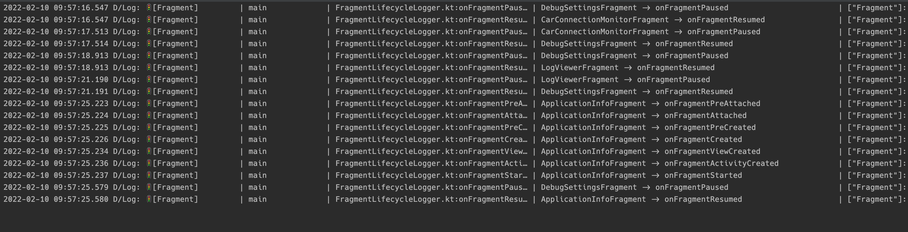

Sensible logging for Android aim to provide no-nonsense logging API that is easily extended. 
The goal of this library is *not* to be rich in features, but to provide a stable baseline for you to build on in your own projects.

> *"The members of the android guild at Volvo Car Mobility had different needs for logging. Some enjoy a nice and clean LogCat log while others like a more verbose approach to logging.*
>
>*With **Sensible logging for Android** we satisfied both of those needs."*

## Core concepts
The library consists of a few fundamental elements:

### Log class
The `Log` class is the main interaction point of this library. 
Inside it you will find the familiar log statement methods such as `Log.d()`

### Channels
`Log` directs the log statements to `Channel` implementations. Think of Channels as sinks you print your statements to.
Currently, the library includes `LogCatChannel` and `StandardOutChannel` (for unit tests).

Depending on your use-case, either implement a subtype of `ReleaseChannel` or `DebugChannel`.

 - `DebugChannel`s are meant to be used during development. Additional to the log-line, it includes the following information:
 ```kotlin
data class Meta(
    val className: String,
    val simpleClassName: String,
    val functionName: String,
    val lineNumber: Int,
    val threadName: String,
    val fileName: String
)
```
_It retrieves this data using `Throwable().stackTrace`. Be aware that it can have negative impact to performance, so default to only use it in debug builds._
 
- `ReleaseChannel`s only include the log-line and are meant to be used in release-builds.

#### Channel ids
A channel has a integer identifier. You can optionally specify a channel ID in your log statement to also print to that channel.

As an example, you can log non-fatal exceptions and messages to your crash reporting service via a `CrashReportingChannel`.
Using that you can easily log to your crash reporting service from wherever in your code.
```kotlin
    Log.e("Something fatal occurred", exception, 4 /*CrashReportingChannel*/)
```

While the channel parameter is an integer. We recommend organising your channels in one file, for auto-completeness. Like so:
```kotlin
typealias Channel = Int

object Channels {
    const val LogCat: Channel = LogCatChannel.ID
    const val CrashReporting: Channel = CrashReportingChannel.ID
}

// then you can autocomplete your way to the channel
Log.e("Something fatal occurred", exception, Channels.CrashReporting)
```

### Filters
```kotlin
interface Filter {
    fun matches(line: Line): Boolean
}
```
To control what a `Channel` should output you pass an instance of `Filter`. You can combine different filters by using the infix functions
`and` & `or`:
```kotlin
    SimpleLogLevelFilter(Level.ERROR) and SimpleCategoryFilter(Categories.UI)
```
would only print messages with level *error* and above, and of the category *UI*.
If you don't care about filters, you can pass the `AllowAllFilter` to your `Channel`.

### Formatters
```kotlin
interface Formatter {
    fun format(line: Line, meta: Meta?): String
}
```
A `Channel` uses a `Formatter` to control the format of the output. If you are directing your output to a file, we recommend using `SimpleFormatter`

### Categories
All log statement methods inside `Log` allow the passing of a log category. This can be used to order your statements into high level areas of interest.
Want to know what is going on with your backend? Direct your network client log statements to the `Network` category, and enable only that category.

Similar to channels, the category parameter is a string. Here we also recommend organising your categories in one file. Like so:

```kotlin
object Categories {
    const val Default = sh.vcm.sensiblelogging.util.Constants.DEFAULT_CATEGORY
    const val Analytics = Category("Analytics")
    const val Network = Category("Network")
    const val Process = Category("Process")
    const val Activity = Category("Activity")
    const val Service = Category("Service")
    const val Fragment = Category("Fragment")
    const val RxJava = Category("RxJava")
    const val FluxCapacitorFeature = Category("FluxCapacitorFeature")
    const val Push = Category("Push")
    const val UI = Category("UI")
}
```

## Usage

### Step 1

```kotlin
    if (BuildConfig.DEBUG) {
    // Sane defaults filter
    val categoriesFilter = Filter.categories(listOf(
        Categories.Default,
        Categories.Network,
        Categories.FluxCapacitorFeature,
        Categories.Process,
        Categories.Activity,
        Categories.Fragment
    ))
    val filterCombination = Filter.level(Level.WARN) or categoriesFilter
    val channels = Log.Setup.Configuration()
        .addLogCatChannel(filter = filterCombination, default = true)
        .create()
    Log.Setup.addChannels(channels)

    // optionally opt-in to logging out Process, Activity and Fragment lifecycle methods from the :lifecycle dependency
    registerLifecycleLoggers(
        processCategory = Categories.Process,
        activityCategory = Categories.Activity,
        fragmentCategory = Categories.Fragment
    )
}
```

### Step 2
```kotlin
 // Log from your code
 // Passing "Default" as category is optional, if no category is passed, default will be used 
 // Passing "LogCat" as channel is optional, if no channel is passed, default will be used 
 Log.d("Initialising the flux capacitor", Categories.Default, Channels.LogCat)
```

### Step 3
Build your own Channels, Filters & Formatters to solve your project needs.

For example: you can log non-fatal exceptions to your crash reporting service via a `CrashReportingChannel`.
The `CrashReportingChannel` can be configured with a `Filter` that only pass a subset of your categories and all logged errors.
Using that you can easily log to this channel from wherever in your code.

Want persisted logs? Implement a `SQLiteChannel` using your favourite ORM library. You can then display those statements from
your debug UI. Or provide a shortcut from your app settings to dump the database to a text file that your users can email to you.

Want to control the log categories in runtime? Use the `SharedPreferencesCategoryFilter` with your `LogCatChannel` and enable updating of it from your debug UI.

Download
--------

```groovy
// in your root build.gradle
repositories {
  mavenCentral()
}

// in your app build.gradle
dependencies {
  implementation 'sh.vcm.sensiblelogging:sensible-logging:1.2.0'
  implementation 'sh.vcm.sensiblelogging:lifecycle:1.2.0'
}
```

## Requirements

 - `minSdk` is currently set to `16`
 - The base library is only dependant on the Android SDK and kotlin stdlib
 - The lifecycle extensions is are dependant on `androidx.appcompat` and `androidx.lifecycle` libraries

## License

    Copyright 2022 Volvo Cars Corporation

    Licensed under the Apache License, Version 2.0 (the "License");
    you may not use this file except in compliance with the License.
    You may obtain a copy of the License at

       http://www.apache.org/licenses/LICENSE-2.0

    Unless required by applicable law or agreed to in writing, software
    distributed under the License is distributed on an "AS IS" BASIS,
    WITHOUT WARRANTIES OR CONDITIONS OF ANY KIND, either express or implied.
    See the License for the specific language governing permissions and
    limitations under the License.
