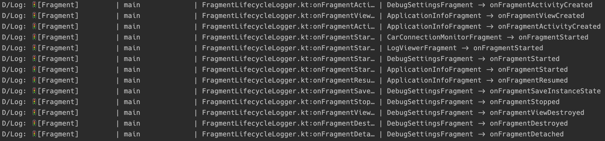

Sensible logging for Android aim to provide no-nonsense logging API that is easily extensible. 
The goal of this library is *not* to be rich in features, but to provide a baseline for you to build on in your own projects.

The members of the android guild at M had different needs for logging. Some enjoy a nice and clean LogCat log while others like more verbose logging.
With android-log we satisfied both needs.

## Project structure
Logging for Android consists of a few fundamental elements:

### Log class
The `Log` class is the main interaction point of this library. 
Inside it you will find those familiar log statement methods such as `Log.d()`

### Printers
`Log` directs the log messages to `Printer` implementations. Think of Printers as channels you print your statements to.
Currently, the library includes `LogCatPrinter`, `NotificationPrinter` and `StandardOutPrinter` (for unit tests).

### Filters
To control what a `Printer` should output you pass an instance of `Filter`. You can combine different filters by using the infix functions
`and` & `or`: for instance, `SimpleLogLevelFilter(Level.ERROR) and SimpleCategoryFilter(Categories.UI)` would only print messages with level *error* and above, and of the category *UI*.
If you don't care about filters, you can pass the `AllowAllFilter` to your `Printer`.

### Formatters


A `Printer` uses a `Formatter` to control the format of the output. The formatter in the screenshot above is called `LogCatFormatterExtended`. 
If you are directing your output to a file, we recommend using `SimpleFormatter`

### Categories
All log statement methods inside `Log` allow the passing of a log category. This can be used to order your statements into high level areas of interest.
Want to know what is going on with your backend? Direct your network client log statements to the `Network` category, and enable only that category.

While the category parameter is a string. We recommend organising your categories in one file. Like so:

```kotlin
typealias Category = String

object Categories {
    const val Default: Category = "Default"
    const val Analytics: Category = "Analytics"
    const val Network: Category = "Network"
    const val Process: Category = "Process"
    const val Activity: Category = "Activity"
    const val Service: Category = "Service"
    const val Fragment: Category = "Fragment"
    const val RxJava: Category = "RxJava"
    const val Push: Category = "Push"
    const val UI: Category = "UI"
}
```

## Usage

### Step 1
```kotlin
    if (BuildConfig.DEBUG) {
    // Sane defaults filter
    val logFilter = SimpleLogLevelFilter(Level.ERROR) or SimpleCategoryFilter(
        listOf(
            Categories.Default,
            Categories.Process,
            Categories.Service,
            // add more categories here
        )
    )

    // attach your printers to the Log framework
    Log.printers(LogCatPrinter(LogCatFormatterExtended, logFilter))

    // optionally opt-in to logging out Process, Activity and Fragment lifecycle methods
    registerLifecycleLoggers(
        processCategory = Categories.Process,
        activityCategory = Categories.Activity,
        fragmentCategory = Categories.Fragment
    )
}
```

### Step 2
```kotlin
 // Log from your code
 // Passing "Default" as category is optional, if no category is passed default will be used 
 Log.d("Initialising the flux capacitor", Categories.Default)
```

### Step 3
Build your own Printers to solve your project needs

For example: you can log non-fatal exceptions to your crash reporting service via a `CrashReportingPrinter`.
The `CrashReportingPrinter` can be configured with a `Filter` that only pass the category `"CrashReportingService"`.
Using that you can easily log to this channel from wherever in your code.

Want persisted logs? Implement a `SqlitePrinter` using your favourite ORM library. You can then display those statements from
your debug UI. Or provide a shortcut from your app settings to dump the database to a text file that your users can email to you.

Want to control the log categories in runtime? Use the `SharedPreferencesCategoryFilter` with your `LogCatPrinter` and enable updating of it from your debug UI.

## Download

```groovy
repositories {
  mavenCentral()
}

dependencies {
  implementation 'co.m.android:log:x.y.z'
}
```


## License

    Copyright 2022 Volvo Car Mobility AB

    Licensed under the Apache License, Version 2.0 (the "License");
    you may not use this file except in compliance with the License.
    You may obtain a copy of the License at

       http://www.apache.org/licenses/LICENSE-2.0

    Unless required by applicable law or agreed to in writing, software
    distributed under the License is distributed on an "AS IS" BASIS,
    WITHOUT WARRANTIES OR CONDITIONS OF ANY KIND, either express or implied.
    See the License for the specific language governing permissions and
    limitations under the License.
